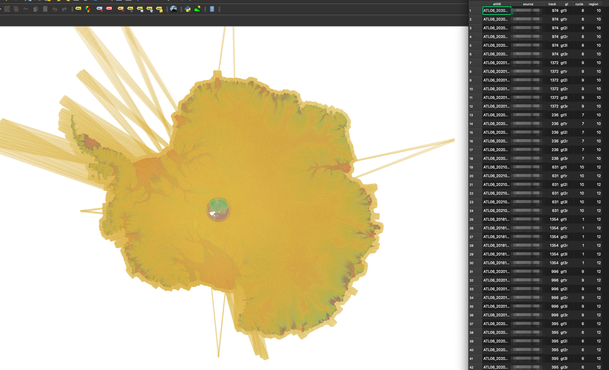

# ICESAT2

ICESAT-2 utilities written in python

by Seongsu Jeong

* `update_atl06.py`
  * Downloads the ATL06 hdf files from NSIDC  
  * Region of interests are Antarctica and Greenland, whose polygons are defined in the code.
    * Any suggestion about the ROI are welcome.
  * Run the code without any arguments to display the usage.
    * Data retrieval with multiple connection is available but under test.
    * Be a good user by spawning a reasonable number of connections to avoid overloading the server!
      * Maybe 2-3 concurrent data stream is enough.

* `import_h5.py`
  * Extracts x,y,z,t info, and error information from the original HDF5 files.
  * Reprojects the coordinates in .hdf5 files into desired map projection
    * provide EPSG number
  * Generates the ATL06 measurement catalog in shapefile. Example as below:
    
  * Run the code without any arguments to display the usage.
